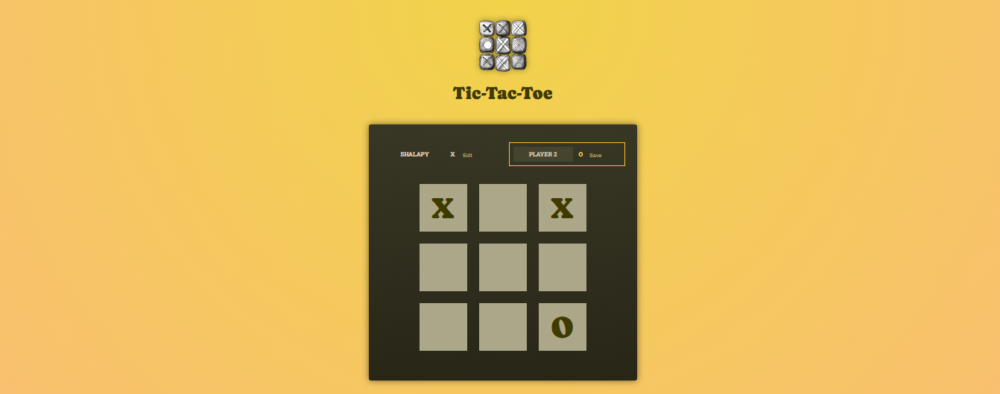

# React Tic-TacT-oe

[](https://react.dev/)


TicTacToe Master is an interactive Tic Tac Toe game built with React. It allows two players to play against each other, with customizable player names, a live game log, and instant win/draw detection. The game is a perfect example of how to use React state and props to create engaging user experiences.

## Project Overview

  
_Screenshot of the game interface._

## Features

- **Customizable Player Names**: Players can edit their names during the game.
- **Real-Time Turn Log**: See the history of moves in real-time.
- **Win/Draw Detection**: The game identifies a winner or declares a draw automatically.
- **Rematch Option**: Quickly reset the game board for another round.
- **Responsive Design**: Works seamlessly across different screen sizes.

## Project Structure

```
React-Tic-Tac-Toe
│
│      .gitignore
│      .vite.config
│      index.html
│      package-lock.json
│      package.json
│      README.md
│
│
└───public
│   bg-pattern-dark.png
│   bg-pattern.png
│   game-logo.png
│   OverView.png
│
└───src
    │   App.jsx
    │   index.jsx
    │   index.css
    │   winning-combinations.js
    │
    ├───assets
    │       react.svg
    │
    ├───components
    │   │   GameBoard.jsx
    │   │   GameOver.jsx
    │   │   Player.jsx
    │   │   Log.jsx
    │   │
```

## Installation

To get started with the project locally:

1. Clone the repository:
   ```bash
   git clone https://github.com/SalahShallapy/React-Tic-Tac-Toe.git
   ```
2. Navigate to the project directory:
   ```bash
   cd React-Tic-Tac-Toe
   ```
3. Install dependencies:
   ```bash
   npm install
   ```
4. Run the project:
   ```bash
   npm run dev
   ```

## How to Play

- Edit player names by clicking the "Edit" button next to their name.
- Players take turns by clicking an empty square.
- The game announces a winner when a player completes a winning combination, or declares a draw when the board is full.
- Click "Rematch" to restart the game.

## Contributing

Contributions are what make the open source community such an amazing place to learn, inspire, and create. Any contributions you make are **greatly appreciated**.

If you have a suggestion that would make this better, please fork the repo and create a pull request. You can also simply open an issue with the tag "enhancement".
Don't forget to give the project a star! Thanks!

1. Fork the Project
2. Create your Feature Branch (`git checkout -b feature/AmazingFeature`)
3. Commit your Changes (`git commit -m 'Add some AmazingFeature'`)
4. Push to the Branch (`git push origin feature/AmazingFeature`)
5. Open a Pull Request

<p align="right">(<a href="#top">back to top</a>)</p>
